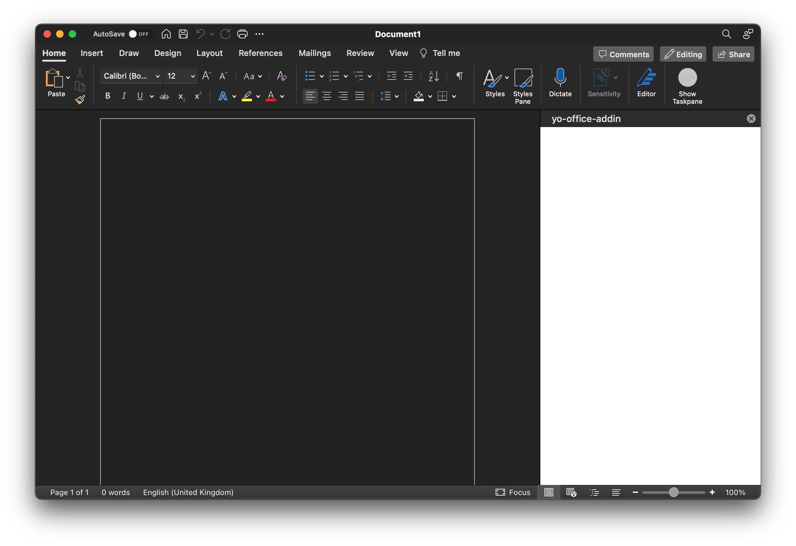
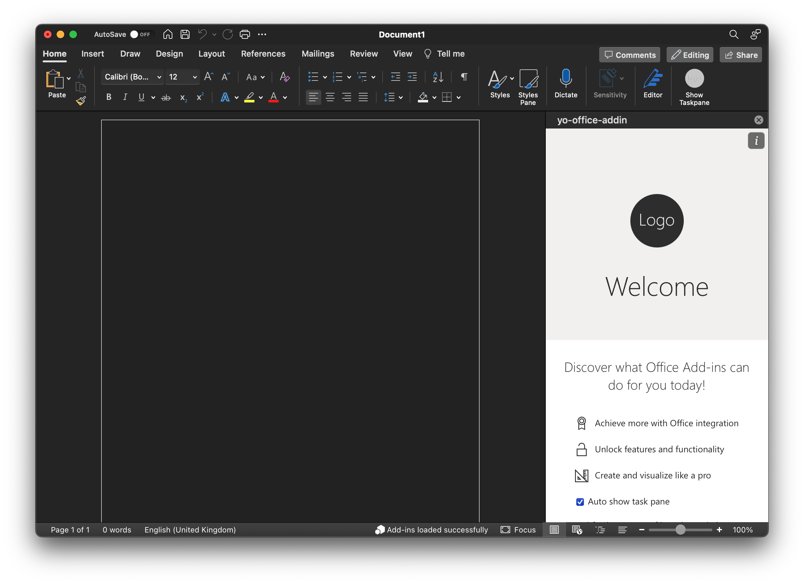

# Auto Show Task Pane With Document

Auto Showing the task pane when a document opens on the Mac does not work when
the Office Add-in is deployed to Office 365 as a `Integrated App`. It appears
to work when the Add-in is side loaded.

Steps to reproduce:

1. Create a basic Add-in using yeoman, `yo office --projectType taskpane --name "yo-office-addin" --host word --ts true`.
2. Update the generated application with a checkbox to set the `Office.AutoShowTaskpaneWithDocument` property.
3. Build the Add-in and start it: `yarn && yarn dev-server`.
4. Modify the `manifest.xml` file with the following change `<TaskpaneId>Office.AutoShowTaskpaneWithDocument</TaskpaneId>`.
5. Using a Microsoft 365 trial developer subscription account, log in as the Administrator and upload the `manifest.xml` as
   a new `Integrated App`.
6. Start Word, create a new document and insert the `Admin Managed` Add-in.
7. Show the task pane using the button on the ribbon bar.
8. Set the check box that was added to the yeoman generated code.
9. Using the `File` menu, save the the document as a template, i.e. `.dotx`, file.
10. Quit Word.
11. Locate the saved `.dotx` file, using Finder, and double click on it.
12. A new document opens in Word, the task pane is visible, but is blank. See below

Actual appearance:

Expected appearance:

Word version: 16.75 (23070901)

Confirmed that the `.dotx` file contains the `webextensions` folder and appropriate `taskpanes.xml` and `webextensions1.xml1 files.

[Source code] (https://github.com/asparrowhawk/yo-office-addin)

